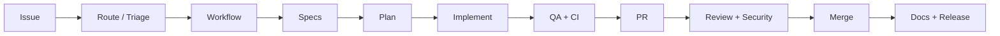

# Platform — Agentic SDLC v2.1

**Reference project:** [agunich/demo-todo-app](https://github.com/agunich/demo-todo-app)

---

## Capabilities

| Area | Notes |
|------|-------|
| Issue → PR pipeline | `run-pipeline` CLI + reusable workflows |
| Workflow routing | workflow-agent + deterministic fallback |
| Spec chain | requirements → product → technical → plan |
| Implement agents | frontend, backend, fullstack, infra |
| Quality gates | code-guard, CI, review, QA, security |
| Architect gate | enterprise / regulated tiers |
| Context Builder | ContextPack, knowledge layers, budgets |
| Knowledge Owners | approvals, sync, enforcement |
| Post-merge SDLC | docs-agent, release-agent, automerge |
| GitHub SoR | Projects v2 sync, label routing, QA status |
| Governance | cost report, audit export, DLQ resume |
| Production auth | GitHub App + PAT fallback, webhooks |
| Client tiers | standard / enterprise / regulated |
| Cloud agent catalog | SKU per agent, packages, licensing |
| App templates | express-api, nextjs-minimal scaffolds |
| Project lifecycle | Phase gates before development pipeline |
| Channel integration | Provider-agnostic chat (Slack, webhook, stdio) |
| Architecture conversation | Approved business → technical docs + ADR generator |
| Dev bridge | Feature intake → GitHub Issue → pipeline + SDLC notifications |
| Commercial licensing | SKU packages, entitlements, cost by agent SKU |

---

## Architecture



---

## Layout

| Path | Purpose |
|------|---------|
| `runtime/` | Node.js dispatcher + CLI |
| `runtime/config/agents/` | Agent runtime definitions |
| `.github/workflows/` | Platform and reusable workflows |
| `templates/project-repo/` | Client onboarding scaffold |
| `governance/` | Cost, audit, failure recovery |
| `docs/handbooks/` | Operations and agent guides |

---

## Documentation

- [Documentation map (start here)](README.md)
- [Architecture Decision Records](architecture/README.md)
- [project-onboarding.md](guides/project-onboarding.md)
- [getting-started.md](guides/getting-started.md)
- [secrets-and-setup.md](guides/secrets-and-setup.md)
- [cloud-agent-catalog.md](guides/cloud-agent-catalog.md)
- [app-templates.md](guides/app-templates.md)
- [project-lifecycle.md](guides/project-lifecycle.md)
- [channel-integration.md](guides/channel-integration.md)
- [architecture-conversation.md](guides/architecture-conversation.md)
- [dev-bridge.md](guides/dev-bridge.md)
- [commercial-licensing.md](guides/commercial-licensing.md)
- [multi-repo-workflows.md](guides/multi-repo-workflows.md)
- [PRODUCTION_READINESS_REPORT.md](../runtime/PRODUCTION_READINESS_REPORT.md)

---

## CLI

```bash
node dist/cli.js run-pipeline --issue N
node dist/cli.js scaffold-app --target ./client --template express-api --project-id ID
node dist/cli.js provision-cloud-agents
node dist/cli.js lifecycle-status --project-dir ./client
node dist/cli.js onboard-project --target ./client --project-id ID --tier standard
node dist/cli.js cost-report
node dist/cli.js dlq-resume --issue N --from plan-agent
```
