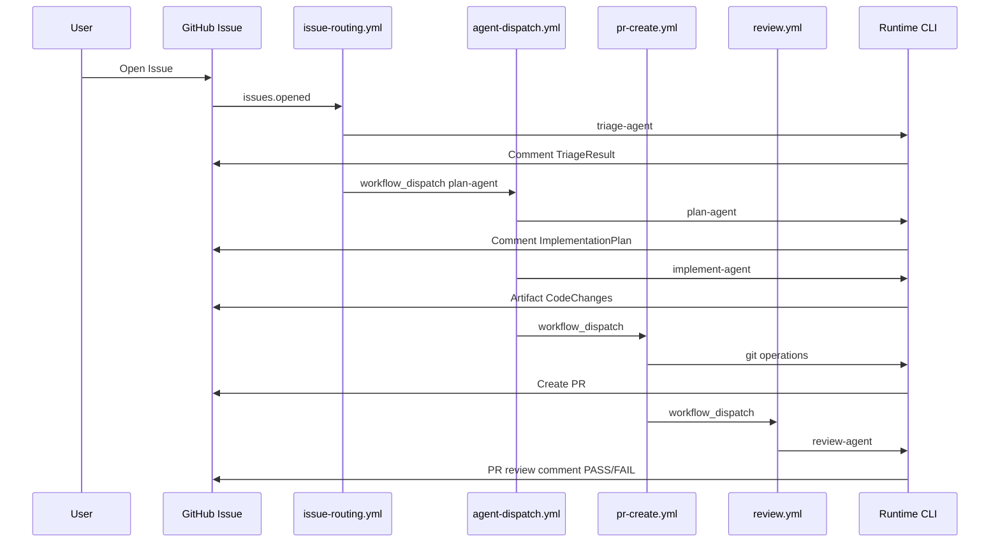
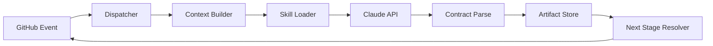

# Runtime Architecture

## Technology Choice: Node.js

| Criterion | Node.js | Python |
|-----------|---------|--------|
| GitHub Actions | Native, no extra setup | Requires setup-python |
| Octokit | Official `@octokit/rest` | PyGithub |
| Anthropic SDK | Official `@anthropic-ai/sdk` | Official `anthropic` |
| Single artifact | Same language as Actions `actions/setup-node` | Split toolchain |

**Decision:** Node.js 20+ TypeScript runtime invoked from GitHub Actions.

## Event Flow

## Dispatch Flow

## Agent Execution Flow

1. Load runtime definition (`runtime/config/agents/{id}.runtime.yaml`)
2. Build ContextPack (issue + manifest + files)
3. Assemble system prompt from `prompts/{id}/` pack (+ standards) + skills
4. Call Claude Messages API
5. Extract `ai-platform-contract` JSON
6. Validate required fields
7. Persist to `.ai-platform/runs/{issue}/{agent}.json`
8. Post Issue/PR comment

## GitHub Integration Flow

- Authentication: `GITHUB_TOKEN` (Actions) or `GH_TOKEN`
- Repository: caller repo (project) via `GITHUB_REPOSITORY`
- Platform path: `PLATFORM_ROOT` env (checkout of ai-platform)
